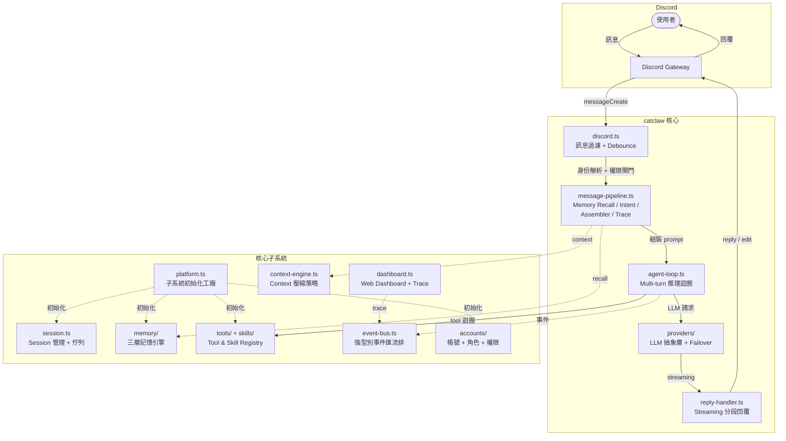

# CatClaw

以 Discord 為介面的 AI Agent 運行平台。

透過 multi-turn agent loop 驅動 LLM，讓你在 Discord 上部署自己的 AI agent — 具備工具執行、三層記憶引擎、context 管理、多 LLM provider failover、排程、帳號權限等完整能力。

## 目標與願景

| 階段 | 定位 | 狀態 |
| ---- | ---- | ---- |
| **Phase 1** | AI 秘書運行平台 — 訊息處理、任務追蹤、排程提醒、知識管理 | **現階段** |
| **Phase 2** | 自治開發能力 — agent 自主搜尋、規劃、執行開發任務 | 進行中 |
| **Phase 3** | 多 Agent 平台 — 多 agent 實例、角色化部署、跨專案協作 | 規劃中 |

> 📖 詳細架構與核心機制說明請見 **[Wiki](https://github.com/wellstseng/catclaw/wiki)**

## 功能總覽

| 類別 | 能力 |
|------|------|
| **Agent Loop** | Multi-turn 推理迴圈、tool 執行、output token recovery、auto-compact |
| **Tools & Skills** | 20+ builtin tools（file/exec/web/memory/subagent）+ 18+ skills |
| **Multi-Provider** | claude-api / ollama / openai-compat / codex-oauth / cli-* + circuit-breaker failover |
| **記憶引擎** | recall（向量+關鍵字）+ extract（自動萃取）+ consolidate（晉升/衰減） |
| **Context Engine** | compaction / budget-guard / sliding-window / overflow-hard-stop |
| **帳號權限** | 註冊、identity linking、5 級角色、per-channel 權限閘門 |
| **Subagent** | 子任務分派 + Discord thread bridge + 追蹤 |
| **排程** | cron / every / at 三種排程 + message / subagent / exec action |
| **Discord** | 串流回覆、debounce、thread 繼承、附件處理、crash recovery |
| **Dashboard** | REST API、trace 視覺化、token 用量追蹤 |

## 架構



## 目錄結構

```text
~/project/catclaw/          <-- 純程式碼（Git repo）
  src/
    core/                   Agent Loop, Platform, Session, Dashboard, Context Engine,
                            Prompt Assembler, Reply Handler, Event Bus, Message Pipeline
    memory/                 三層記憶引擎（engine, recall, extract, consolidate）
    providers/              LLM Provider 抽象（claude-api, ollama, openai-compat, cli-*）
    tools/                  Tool Registry + 20+ builtin tools
    skills/                 Skill Registry + 18+ builtin skills
    hooks/                  Hook 系統（tool 前後觸發）
    safety/                 安全攔截（guard, collab-conflict, reversibility）
    workflow/               工作流引擎（rut, oscillation, fix-escalation, sync）
    accounts/               帳號 + 角色 + 權限 + identity linking
    mcp/                    MCP client + Discord MCP server
    vector/                 Ollama embedding + LanceDB 向量搜尋
    discord/                Discord 附加模組
    projects/               專案管理
  catclaw.js                CLI 進入點
  ecosystem.config.cjs      PM2 設定

~/.catclaw/                 <-- CATCLAW_CONFIG_DIR（使用者資料）
  catclaw.json              主設定檔（JSONC）
  models-config.json        模型設定
  workspace/
    CATCLAW.md              Agent 行為規則（system prompt）
    data/
      sessions/             Session 持久化
      cron-jobs.json        Cron 定義
  memory/                   記憶根目錄
    _vectordb/              LanceDB 向量資料庫
```

## 快速開始

### 前置需求

- Node.js >= 18
- [pnpm](https://pnpm.io/)
- Discord Bot Token（[Discord Developer Portal](https://discord.com/developers/applications)）
- LLM Provider 至少一個：Anthropic API key / Ollama / OpenAI-compatible

### 安裝

```bash
git clone git@github.com:wellstseng/catclaw.git
cd catclaw
pnpm install
pnpm build
```

### 設定

```bash
mkdir -p ~/.catclaw/workspace/data/{sessions,active-turns}
cp catclaw.example.json ~/.catclaw/catclaw.json
```

編輯 `~/.catclaw/catclaw.json`（JSONC）：

```jsonc
{
  "discord": {
    "token": "你的 Discord Bot Token",
    "dm": { "enabled": true },
    "guilds": {
      "<伺服器 ID>": {
        "allow": true,
        "requireMention": true
      }
    }
  },
  "providerRouting": {
    "failoverChain": ["anthropic", "ollama"],
    "circuitBreaker": { "threshold": 3, "cooldownMs": 60000 }
  },
  "memory": { "enabled": true }
}
```

編輯 `~/.catclaw/models-config.json`：

```jsonc
{
  "primary": "sonnet",
  "fallbacks": ["haiku"],
  "aliases": {
    "sonnet": "anthropic/claude-sonnet-4-6",
    "opus": "anthropic/claude-opus-4-6",
    "haiku": "anthropic/claude-haiku-4-5-20251001"
  }
}
```

> 完整設定欄位參考：[CONFIG-REFERENCE](_AIDocs/02-CONFIG-REFERENCE.md)

### 啟動

```bash
node catclaw.js start
```

## CLI 指令

```bash
node catclaw.js start                    # tsc 編譯 + PM2 啟動
node catclaw.js restart                  # 重新編譯 + 重啟
node catclaw.js stop                     # 停止
node catclaw.js logs                     # 即時 log
node catclaw.js status                   # 狀態
node catclaw.js reset-session            # 清除所有 session
node catclaw.js reset-session <channel>  # 清除指定 channel
```

## 環境變數

| 變數 | 預設 | 說明 |
| ---- | ---- | ---- |
| `CATCLAW_CONFIG_DIR` | `~/.catclaw` | catclaw.json 所在目錄 |
| `CATCLAW_WORKSPACE` | `~/.catclaw/workspace` | Agent 工作目錄 |

## 文件

- **[Wiki — 核心機制與架構](https://github.com/wellstseng/catclaw/wiki)** — Agent Loop、記憶引擎、Provider、Context Engine 等深入說明
- **[設定參考](_AIDocs/02-CONFIG-REFERENCE.md)** — 完整設定欄位

## License

MIT
