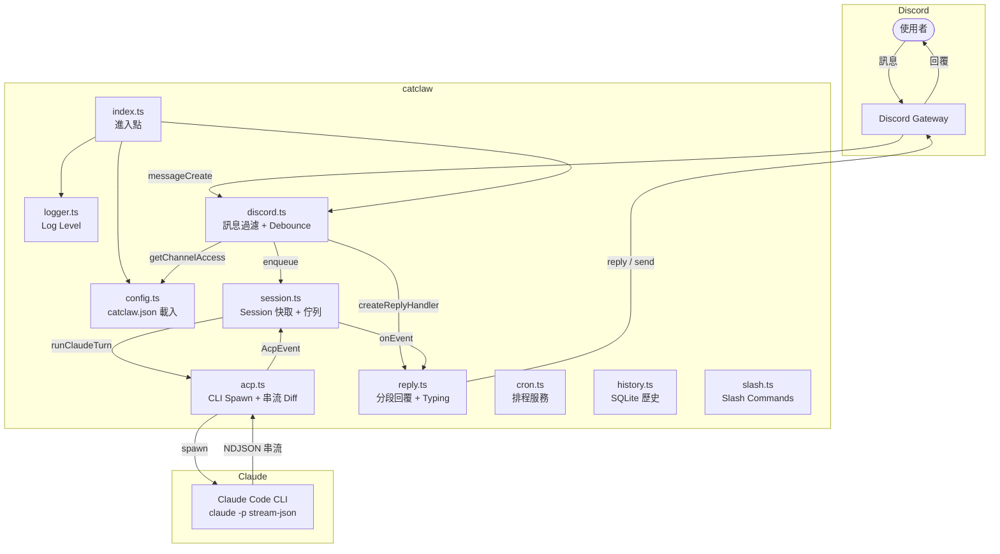

# catclaw

輕量 Discord Bot，直接透過 [Claude Code CLI](https://docs.anthropic.com/en/docs/claude-code) 進行對話。不依賴 Claude API SDK 或 OpenClaw。

## 功能

- 串流回覆（即時顯示 Claude 輸出）
- Per-channel 設定（allow / requireMention / allowBot / allowFrom）
- Thread 繼承（thread → parent channel → guild 預設）
- Persistent session（同頻道延續對話上下文）
- 多頻道並行（不同 channel 平行處理，同 channel 串行佇列）
- DM 支援（直接私訊 bot）
- Typing indicator（回應中顯示打字狀態）
- Turn timeout（基礎 5 分鐘，tool call 延長至 ~8 分鐘）
- Turn timeout 80% 警告（送 ⏳ 提示）
- Debounce（短時間內多則訊息自動合併）
- Crash recovery（重啟後清理中斷的 turn）
- Signal-based restart（Discord 頻道觸發 PM2 重啟並通知）
- Config hot-reload（修改 catclaw.json 自動生效，不需重啟）
- Cron 排程（定時送訊息 / 開 Claude turn / 執行 shell）
- Slash commands
- 對話歷史記錄（SQLite）
- 2000 字自動分段 + code fence 跨段平衡
- 附件下載（使用者上傳檔案 → Claude 可讀取）
- MEDIA token 檔案上傳（Claude 回覆含 `MEDIA: /path` → 自動上傳至 Discord）
- 長回覆自動轉 .md 檔案上傳（超過 fileUploadThreshold）
- Thinking 顯示（可選，引用格式）
- showToolCalls 三級控制（all / summary / none）

## 架構



## 目錄結構

程式碼與資料完全分離：

```
~/project/catclaw/         ← 純程式碼（Git repo）
  src/
  dist/
  signal/                  ← PM2 重啟 signal 檔（自動生成）

~/.catclaw/                ← CATCLAW_CONFIG_DIR（使用者資料）
  catclaw.json             ← 主設定檔（JSONC，支援 // 註解）
  workspace/               ← CATCLAW_WORKSPACE（Claude CLI cwd）
    AGENTS.md              ← Claude 行為規則
    data/
      sessions.json        ← Session 持久化
      cron-jobs.json       ← Cron 定義 + 狀態
      active-turns/        ← Crash recovery 追蹤
    history.db             ← 對話歷史（SQLite）
```

## 前置需求

- Node.js >= 18
- [pnpm](https://pnpm.io/)
- [Claude Code CLI](https://docs.anthropic.com/en/docs/claude-code)（需在 PATH 中可用）
- Discord Bot Token（從 [Discord Developer Portal](https://discord.com/developers/applications) 取得）

## 安裝

```bash
git clone <repo>
cd catclaw
pnpm install
pnpm build
```

## 設定

catclaw.json 放在 `~/.catclaw/catclaw.json`（JSONC 格式，支援 `//` 註解）：

```jsonc
{
  "discord": {
    "token": "你的 Discord Bot Token",
    "dm": { "enabled": true },
    "guilds": {
      "<伺服器 ID>": {
        "allow": true,
        "requireMention": true,
        "allowBot": false,
        "allowFrom": [],
        "channels": {
          "<頻道 ID>": { "allow": true, "requireMention": false }
        }
      }
    }
  },
  "turnTimeoutMs": 300000,
  "turnTimeoutToolCallMs": 480000,
  "sessionTtlHours": 168,
  "showToolCalls": "summary",
  "showThinking": false,
  "debounceMs": 500,
  "fileUploadThreshold": 4000,
  "logLevel": "info",
  "cron": { "enabled": false, "maxConcurrentRuns": 1 }
}
```

### 設定說明

| 欄位 | 說明 | 預設值 |
|------|------|--------|
| `discord.token` | Discord Bot Token（必填） | — |
| `discord.dm.enabled` | 是否啟用 DM 回應 | `true` |
| `discord.guilds` | Per-guild/channel 設定 | `{}` |
| `turnTimeoutMs` | 基礎回應超時（ms） | `300000` (5 分鐘) |
| `turnTimeoutToolCallMs` | Tool call 時延長超時（ms） | `480000` (~8 分鐘) |
| `sessionTtlHours` | Session 閒置過期時間 | `168` (7 天) |
| `showToolCalls` | 工具呼叫顯示：`all` / `summary` / `none` | `"summary"` |
| `showThinking` | 是否顯示 Claude 思考過程 | `false` |
| `debounceMs` | 同一人連續訊息合併等待時間（ms） | `500` |
| `fileUploadThreshold` | 回覆超過此字數自動上傳為 .md（0 = 停用） | `4000` |
| `logLevel` | Log 層級：`debug` / `info` / `warn` / `error` / `silent` | `"info"` |
| `cron.enabled` | 啟用 cron 排程 | `false` |
| `cron.maxConcurrentRuns` | Cron 最大並發數 | `1` |

### Guild 設定繼承鏈

```
Thread → channels[threadId] → channels[parentId] → Guild 預設
```

| Guild 欄位 | 說明 |
|-----------|------|
| `allow` | 是否允許此 guild |
| `requireMention` | 需要 @mention bot 才觸發 |
| `allowBot` | 是否允許其他 bot 觸發 |
| `allowFrom` | 白名單使用者 ID（空 = 全部允許） |
| `channels` | Per-channel 覆寫設定（繼承 guild 預設） |

### 環境變數

| 變數 | 預設 | 說明 |
|------|------|------|
| `CATCLAW_CONFIG_DIR` | `~/.catclaw` | catclaw.json 位置 |
| `CATCLAW_WORKSPACE` | `~/.catclaw/workspace` | Claude CLI cwd |
| `CATCLAW_CLAUDE_BIN` | `"claude"` | claude binary 路徑 |
| `ACP_TRACE` | — | `1` 啟用 debug 串流輸出 |

## 啟動

使用 PM2 管理程序（推薦）：

```bash
node catclaw.js start        # tsc 編譯 + PM2 啟動
node catclaw.js restart      # tsc 重新編譯 + PM2 重啟
node catclaw.js stop         # PM2 停止
node catclaw.js logs         # PM2 即時 log
node catclaw.js status       # PM2 狀態
node catclaw.js reset-session             # 清除所有 session
node catclaw.js reset-session <channelId> # 清除指定 channel
```

## Claude CLI 介接

本專案不使用 Claude API SDK，直接 spawn Claude Code CLI 子程序：

```bash
claude -p --output-format stream-json --verbose --include-partial-messages \
  --dangerously-skip-permissions [--resume <sessionId>] "<prompt>"
```

### 串流 Diff 機制

CLI 的 `--include-partial-messages` 回傳**累積文字**（非 delta）。`acp.ts` 追蹤 `lastTextLength`，每次 `fullText.slice(lastTextLength)` 提取新增部分。

### Session 延續

- 首次：無 `--resume`，從 `session_init` event 取 UUID 並快取
- 後續：`--resume <UUID>` 延續上下文
- 持久化：`data/sessions.json`（atomic write）
- TTL 超時 → 自動開新 session

## Cron 排程

定義檔：`~/.catclaw/workspace/data/cron-jobs.json`（hot-reload）

```jsonc
{
  "jobs": [
    {
      "id": "daily-standup",
      "schedule": "0 9 * * 1-5",
      "channelId": "<頻道 ID>",
      "action": "claude",
      "prompt": "產生今日站立會議提醒"
    }
  ]
}
```

| 排程類型 | 設定方式 |
|---------|---------|
| Cron | `"schedule": "0 9 * * *"` |
| 固定間隔 | `"everyMs": 3600000` |
| 一次性 | `"at": "2026-01-01T09:00:00"` |

Action 類型：`message`（送固定訊息）、`claude`（開 Claude turn）、`exec`（執行 shell 指令）

## 檔案上傳

### Inbound（使用者 → Claude）

使用者附帶檔案 → 自動下載至 `/tmp/claude-discord-uploads/{messageId}/` → Claude 透過 Read 工具讀取。

### Outbound（Claude → Discord）

Claude 回覆中包含 `MEDIA: /absolute/path/to/file` → 自動解析並上傳為 Discord 附件。

### 長回覆自動上傳

回覆總字數超過 `fileUploadThreshold`（預設 4000）→ 自動上傳為 `response.md` + 前 150 字預覽。

## 專案結構

```
catclaw/
├── src/
│   ├── index.ts        進入點、啟動序列、關閉處理
│   ├── config.ts       catclaw.json 載入 + hot-reload + per-channel helper
│   ├── logger.ts       Log level 控制
│   ├── discord.ts      Discord client + 訊息過濾 + debounce
│   ├── session.ts      Session 快取 + per-channel 串行佇列 + timeout + crash recovery
│   ├── acp.ts          Claude CLI spawn + 串流 diff + AcpEvent
│   ├── reply.ts        Discord 回覆分段 + typing + thinking + MEDIA upload
│   ├── cron.ts         Cron 排程服務
│   ├── history.ts      SQLite 對話歷史
│   └── slash.ts        Slash commands
├── catclaw.js          CLI 進入點（start/restart/stop/logs/status/reset-session）
├── ecosystem.config.cjs PM2 設定
├── package.json
└── tsconfig.json
```

## License

MIT
