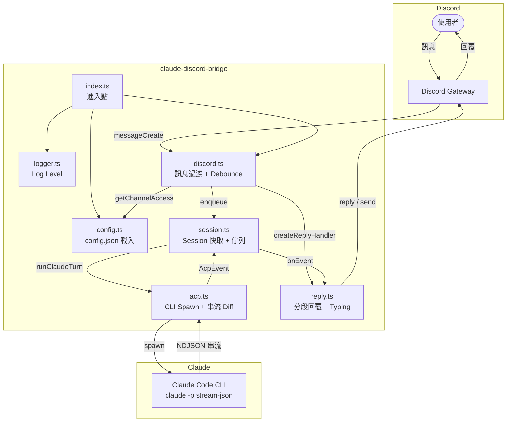
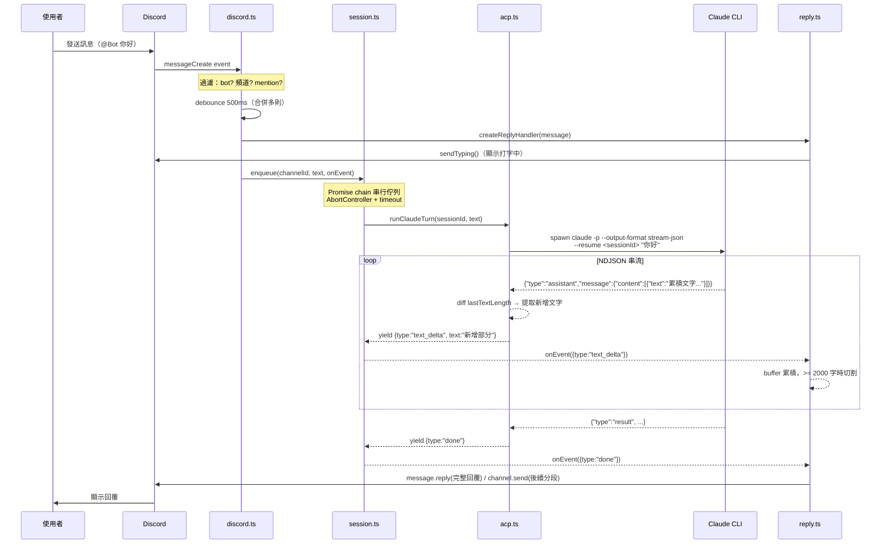
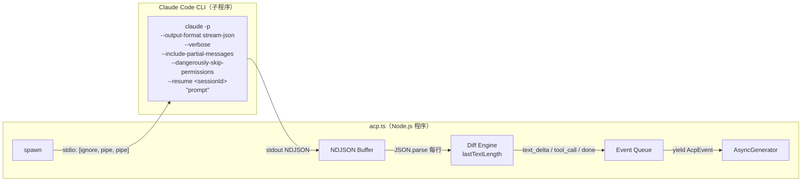
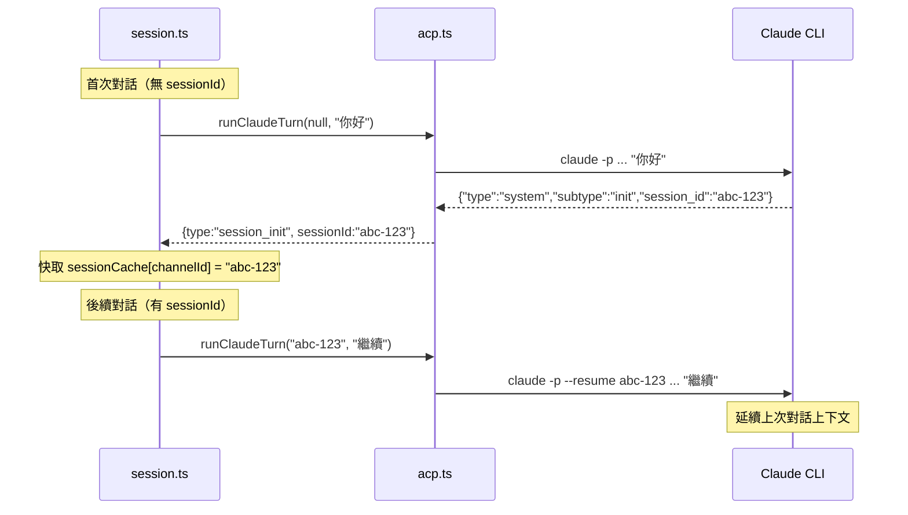

# claude-discord-bridge

輕量 Discord Bot，直接透過 [Claude Code CLI](https://docs.anthropic.com/en/docs/claude-code) 進行對話。

## 功能

- 串流回覆（即時顯示 Claude 輸出）
- Per-channel 設定（allow / requireMention）
- Persistent session（同頻道延續對話上下文）
- 多頻道並行（不同 channel 平行處理，同 channel 串行）
- DM 支援（直接私訊 bot）
- Typing indicator（回應中顯示打字狀態）
- Turn timeout（超時自動取消）
- Debounce（短時間內多則訊息自動合併）
- 2000 字自動分段 + code fence 跨段平衡

## 架構



## 訊息處理流程



## Claude CLI 介接

本專案不使用 Claude API SDK，而是直接 spawn Claude Code CLI 子程序進行對話：



### 串流 Diff 機制

Claude CLI 的 `--include-partial-messages` 回傳的是**累積文字**（不是 delta）：

```
事件 1: text = "你"           → delta = "你"     (length 0→1)
事件 2: text = "你好"          → delta = "好"     (length 1→2)
事件 3: text = "你好，我是"     → delta = "，我是"  (length 2→5)
```

`acp.ts` 追蹤 `lastTextLength`，每次用 `fullText.slice(lastTextLength)` 提取新增部分。

### Session 延續



## 前置需求

- Node.js >= 18
- [pnpm](https://pnpm.io/)
- [Claude Code CLI](https://docs.anthropic.com/en/docs/claude-code)（需在 PATH 中可用）
- Discord Bot Token（從 [Discord Developer Portal](https://discord.com/developers/applications) 取得）

## 安裝

```bash
git clone https://github.com/wellstseng/claude_discord.git
cd claude_discord
pnpm install
pnpm build
```

## 設定

複製範本並編輯：

```bash
cp config.example.json config.json
```

### config.json 結構

```json
{
  "token": "你的 Discord Bot Token",

  "showToolCalls": false,

  "dm": {
    "enabled": true
  },

  "guilds": {
    "<伺服器 ID>": {
      "channels": {
        "<頻道 ID>": {
          "allow": true,
          "requireMention": false
        },
        "<另一頻道 ID>": {
          "allow": true,
          "requireMention": true
        }
      }
    }
  },

  "claudeCwd": "",
  "claudeCommand": "claude",
  "debounceMs": 500,
  "turnTimeoutMs": 300000,
  "logLevel": "info"
}
```

### 設定說明

| 欄位 | 說明 | 預設值 |
|------|------|--------|
| `token` | Discord Bot Token（必填） | — |
| `showToolCalls` | 是否在 Discord 顯示工具呼叫訊息 | `true` |
| `dm.enabled` | 是否啟用 DM 回應 | `true` |
| `guilds` | Per-guild/channel 設定（空物件 = 所有頻道允許） | `{}` |
| `claudeCwd` | Claude CLI 的工作目錄 | `$HOME` |
| `claudeCommand` | Claude CLI 路徑 | `"claude"` |
| `debounceMs` | 同一人連續訊息的合併等待時間（ms） | `500` |
| `turnTimeoutMs` | Claude 回應超時（ms） | `300000` |
| `logLevel` | Log 層級：`debug` / `info` / `warn` / `error` / `silent` | `"info"` |

### Per-Channel 設定

| 欄位 | 說明 | 預設值 |
|------|------|--------|
| `allow` | 是否允許回應此頻道 | — |
| `requireMention` | 是否需要 @mention bot 才觸發 | `true` |

- `guilds` 為空物件 → 所有頻道皆允許，預設需要 mention
- `guilds` 有設定 → 只有明確 `allow: true` 的頻道會回應

## 啟動

```bash
pnpm start
```

開發模式（自動重新編譯）：

```bash
pnpm dev
# 另一終端
pnpm start
```

## 專案結構

```
claude_discord/
├── src/
│   ├── index.ts        進入點
│   ├── config.ts       config.json 載入 + per-channel helper
│   ├── logger.ts       Log level 控制
│   ├── discord.ts      Discord client + debounce + 訊息過濾
│   ├── session.ts      Session 快取 + per-channel 串行佇列
│   ├── acp.ts          Claude CLI spawn + 串流解析
│   └── reply.ts        Discord 回覆分段 + typing
├── config.example.json 設定範本
├── package.json
└── tsconfig.json
```

## License

MIT
