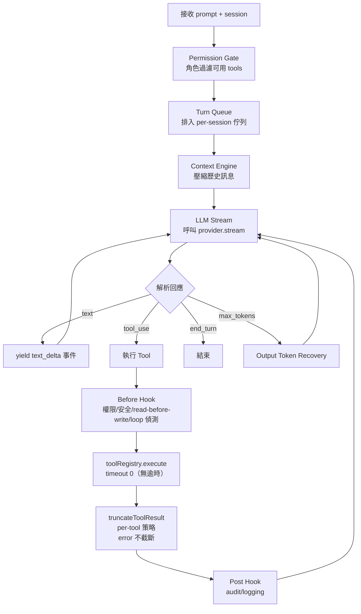

# Agent Loop

`src/core/agent-loop.ts` — CatClaw 的核心推理引擎，實現 multi-turn tool-use 迴圈。

## 運作流程



## 關鍵機制

### Turn Queue

每個 session 有獨立的 FIFO 佇列，確保同一 channel 的訊息串行處理：

- 最大深度：5（超過直接拒絕）
- 單 turn 超時：300s（或 config `turnTimeoutMs`，最低 120s）
- 透過 `SessionManager.enqueueTurn()` 排入

### LLM Stream Loop

- 最大輪數：`MAX_LOOPS = 20`
- 每輪呼叫 `provider.stream()` 取得 LLM 回應
- 遇到 `tool_use` → 執行工具 → 結果送回下一輪
- 遇到 `end_turn` → 結束迴圈
- 遇到 `max_tokens` → 觸發 Output Token Recovery

### Output Token Recovery

LLM 輸出被截斷時（`max_tokens` stop reason），自動續接：

- 最多續接 `MAX_CONTINUATIONS = 3` 次
- 將截斷的回應作為 context 送入下一次 stream
- 讓 LLM 從截斷處繼續生成

### Tool 執行流程

每個 tool call 經過 before/after hooks：

**Before Hooks：**
- **Permission Check** — 確認帳號有權使用該 tool
- **Safety Guard** — 危險操作攔截
- **Read-Before-Write** — 寫入前必須先讀取
- **Loop Detection** — 三層防禦（見下方）

**After Hooks：**
- Audit logging
- Event bus 事件發射
- Memory extract 觸發

### Tool Loop Detection

四層防禦避免 LLM 陷入重複操作：

| 層級 | 偵測條件 | 動作 |
| ---- | -------- | ---- |
| Exact Loop | 同參數呼叫 3 次 | 中斷 + 警告 |
| Loose Retry | 最近 10 次中 ≥8 次同 tool，且其中 ≥5 次「失敗 + args 相似於當前 call」 | 中斷 + 警告（單看 tool name 會誤擋探索性呼叫，需疊 args 相似度 + 失敗判定） |
| Alternating Cycle | 交替循環偵測 | 中斷 + 警告 |
| **Scattered Repeat + 0-progress**（4-24） | 散彈式重複（不同工具但相同意圖反覆嘗試）+ 0 進度守門 | 中斷 + 警告，避免 LLM 跳工具卻原地踏步 |

### TurnTracker

監控每個 turn 的 tool 使用模式：

- **Rut Signal**：同一檔案被編輯 3 次以上 → 發出 rut 信號
- **Intent Classification**：依 tool 使用分類（coding / research / conversation）
- **Reversibility Assessment**：為 tool 操作評分 0-3，高風險操作觸發警告

### Auto-Compact

當 Context Engine 在 turn 中觸發壓縮策略時，壓縮後的訊息會回寫到 session，確保下一輪使用壓縮後的歷史。

### Soft-Inject 插話處理（4-23 + 4-27）

Turn 進行中使用者插話（含訊息編輯）時：

- **不 hard-abort**：原本 abort 會讓 user prompt + 已組裝 partial assistant 雙雙丟失（user 看不到任何回應）
- **改 soft-inject**：當 turn 結束前注入 `[使用者新訊息（turn 進行中插入）] {msg}` + 明確指示「**當作 user 新請求對待，重新評估方向**，除非任務真正完成否則不要 end_turn」（4-27 framing 強化，原 `[使用者插話]` 被 LLM 誤讀為「補充 context」造成提早 end_turn）
- **abort 路徑保留**：但不丟 user prompt 與已生成內容

### Deferred Tool 完整修補（4-23）

Deferred tool（schema 不在初始 context，需 `tool_search` 活化）多項治本：

- 活化改信任 `tool_search` result，禁模糊匹配
- `tool_search` 後空回應自動續接 + 強化 deferred 指示
- Deferred 活化節流（一次活化多個會觸發 Anthropic 空回應）
- Deferred nudge 上限 3 + 耗盡後通知使用者
- Provider error 不再被吞，trace turnIndex 與 tool-log 檔名差 1 修復

### Subagent 完成通知（4-26）

`spawn_subagent` 完成後：

- 結果 ≤ 1980 字 → 單則 reply（inline）
- 結果 > 1980 字 → 自動分段，每段加 `_(i/total)_` 頁碼讓使用者看全貌（不用附件，行動裝置直接讀）
- code fence 跨段自動補頭尾 ` ``` `（不破壞 markdown 結構）

### Agent Skills 主對話載入（4-24）

主對話也載入 agent skills + 自建提示（原本只在 subagent 載入）；CATCLAW.md 加「對話 vs 任務的工具邊界」硬規則 — 當前頻道回覆直接寫文字，不用 MCP。

## 事件流

`agentLoop()` 是 `AsyncGenerator`，yield 以下事件類型：

| 事件 | 說明 |
| ---- | ---- |
| `text_delta` | LLM 文字輸出（streaming） |
| `tool_use` | 開始執行 tool |
| `tool_result` | Tool 執行結果 |
| `thinking` | LLM 思考過程（extended thinking） |
| `error` | 錯誤 |
| `done` | Turn 完成 |

## Turn Cap Warning

Session 的 `turnCount` 超過 `contextEngineering.turnCapWarning`（預設 100）且為 20 的倍數時，發出 `log.warn` 建議執行 `/clear-session`。設 0 關閉。
