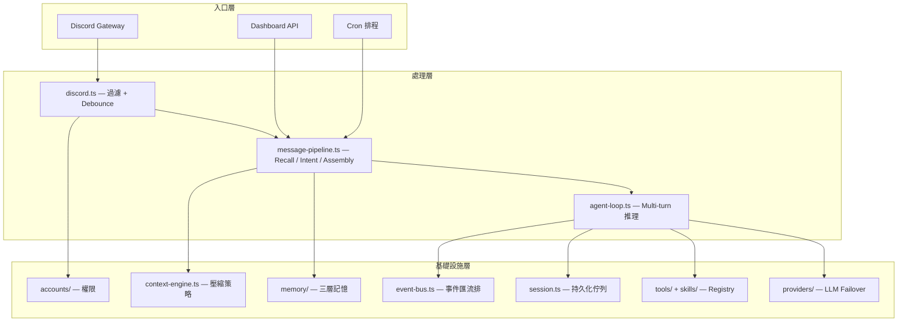

# Architecture

## 整體架構

CatClaw 採用**管線式架構**，訊息從 Discord 進入後經過多層處理，最終由 Agent Loop 驅動 LLM 完成推理與工具執行。



## 資料流

一則 Discord 訊息的完整生命週期：

```text
1. Discord messageCreate 事件
2. discord.ts — bot 自身過濾、channel 權限檢查、mention 檢查
3. Debounce — 500ms 內同作者多則訊息合併
4. 身份解析 — Discord userId → CatClaw accountId（含 guest 自動建立）
5. message-pipeline.ts:
   a. Memory Recall（向量 + 關鍵字搜尋）
   b. Intent Detection（coding / research / conversation）
   c. Mode Extras 載入
   d. System Prompt Assembly（模組化組裝 + module filter）
   e. Inbound History 注入（可選）
6. agent-loop.ts:
   a. Permission Gate — 依角色過濾可用 tools
   b. Turn Queue — 排入 per-session 佇列
   c. Context Engine — 壓縮歷史訊息
   d. LLM Stream Loop（最多 20 輪）
   e. Tool 執行 + before/after hooks
   f. Output Token Recovery（最多 3 次續接）
7. reply-handler.ts — Streaming 分段回覆到 Discord
8. Memory Extract — 非同步萃取新知識（fire-and-forget）
```

## Platform 初始化

`platform.ts` 的 `initPlatform()` 按順序初始化所有子系統：

| 順序 | 子系統 | 說明 |
| ---- | ------ | ---- |
| 1 | AccountRegistry | 載入帳號、自動建立 platform-owner |
| 2 | ToolRegistry | 載入 builtin tools、啟用 hot-reload |
| 3 | PermissionGate | 初始化角色-工具權限閘門 |
| 4 | SafetyGuard | 安全攔截設定 |
| 5 | ProviderRegistry | LLM Provider 註冊 + failover chain |
| 6 | SessionManager | Session 持久化、TTL 清理、載入現有 session |
| 7 | Registration + IdentityLinker | 使用者註冊 + 身份綁定 |
| 8 | OllamaClient | Embedding 客戶端（可選） |
| 9 | MemoryEngine | 三層記憶引擎初始化 |
| 10 | RateLimiter | 角色級速率限制 |
| 11 | ContextEngine | 壓縮策略鏈初始化 |
| 12 | SubagentRegistry | 子任務並行限制 |
| 13 | CollabConflictDetector | 多人衝突偵測 |
| 14 | Dashboard | Web Dashboard + Trace |
| 15 | WorkflowEngine | 背景萃取/鞏固/rut 偵測 |
| 16 | MCP Servers | MCP 連線（可選） |
| 17 | HookRegistry | 使用者自訂 hooks |

所有子系統透過 singleton accessor（`getPlatformToolRegistry()` 等）全域存取。

## 設計原則

- **One-Track Control**：LLM 只負責思考與決策，所有工具執行由 CatClaw 控制
- **Registry Pattern**：Tool / Skill / Provider 皆透過 Registry 動態註冊，支援 hot-reload
- **Strategy Pattern**：Context Engine 的壓縮策略可插拔、可組合
- **Fire-and-Forget**：Memory Extract 等非關鍵路徑採非同步執行
- **Atomic Persistence**：Session 寫入用 `.tmp` → rename，確保 crash-safe
- **程式碼與資料分離**：`~/project/catclaw/` 純程式碼，`~/.catclaw/` 使用者資料
