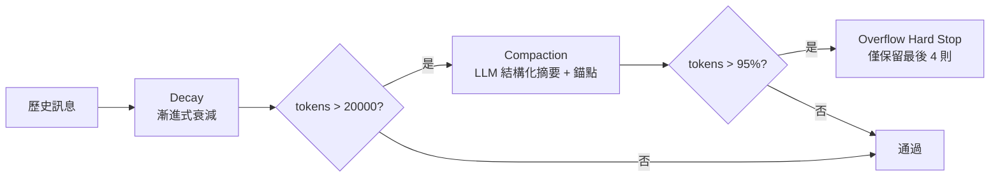

# Context Engine

`src/core/context-engine.ts` — Strategy Pattern 架構，管理 messages 歷史的 token 使用量，避免超出 LLM context window。

> 詳細 API / 型別 / 設定欄位請見 [`_AIDocs/modules/context-engine.md`](../_AIDocs/modules/context-engine.md)

## 策略鏈

```text
Decay → Compaction → Overflow Hard Stop
```

- **Decay**：每次 build 都跑（漸進式衰減 + 外部化）
- **Compaction**：tokens > 20000 時跑（LLM 結構化摘要 + 意圖錨點）
- **Overflow Hard Stop**：tokens > window × 95% 時的最後防線



## 1. Decay Strategy（漸進式衰減）

每次 build 都執行，依 message 的 turn age 計算 targetLevel。

### Decay Levels

| Level | 預設 minAge | maxTokens | 行為 |
|-------|-----------|-----------|------|
| L1 | 1 | 2000 | 精簡（截斷長內容） |
| L2 | 3 | 500 | 核心（只保留關鍵） |
| L3 | 6 | 80 | stub 占位 |
| L4 | 10 | — | 移除 |

### 模式

- **auto**（預設）：`max(discrete, continuous with tempo)` 三合一
- **discrete**：固定 minAge 跳級
- **continuous**：`retainRatio = e^(-baseDecay × age)` 平滑曲線
- **time-aware**：continuous + tempo multiplier（依對話節奏動態調整）

### Externalization（整合在 Decay 內）

`targetLevel >= triggerLevel(2)` AND `originalTokens >= 300` → 截斷前先把原文存到 `data/externalized/{session}/msg_t{N}_i{M}.json`，context 只留純路徑指標：

```
[📄 外部化] assistant turn 5（原始 1234 tokens 已存至檔案）
→ /abs/path/data/externalized/.../msg_t5_i12.json
⚠️ 如需原文請用 read_file 讀取上方絕對路徑。若無法讀取則告知使用者，勿腦補。
```

預設 TTL 14 天，`initContextEngine` 會清理過期檔案。

## 2. Compaction Strategy

**觸發**：`estimatedTokens > triggerTokens`（預設 **20000**）

### 流程

1. 保留最近 `preserveRecentTurns × 2` 條 messages（預設 8 turns ≈ 16 messages）
2. 過濾掉 stub / 工具索引 / 外部化標記（避免雙重失真）
3. 扁平化為文字（切割上限見下表）→ LLM 結構化摘要
4. 摘要結果作為 `[對話摘要｜多輪壓縮，非原文，可能遺漏細節]` user message 置入
5. **追加意圖錨點**：使用者最近一則 ≥50 char 的原文（取前 800 char）
6. System messages 不壓縮；過濾後無語意內容 → 跳過

### 摘要 Prompt 結構（agent 接續視角）

System prompt 定位 LLM 為「紀錄員」，要求第一人稱（我），優先保留**使用者意圖**與**未解決問題**。
User prompt 強制六段結構化章節（缺項填「無」、不得省略）：

| 章節 | 內容 |
|------|------|
| 使用者意圖 | 使用者真正想完成的事（用使用者的話，非我做了什麼） |
| 已決策事項 | 雙方明確同意採用 / 拒絕的方案、使用者偏好 |
| 待辦／進行中 | 我答應要做但還沒完成的事 |
| 未解決問題 | 使用者問了但沒得到滿意答案、卡住點、歧義 |
| 工具產出重點 | 工具呼叫的「結論」（不列流水帳） |
| 重要事實 / 限制 | 會讓接續搞錯的關鍵事實（路徑、決策原因、規格限制） |

### 訊息扁平化切割上限

| 型別 | 上限（chars） |
|------|-------------|
| user text | 2000 |
| assistant text | 1500 |
| tool_use input | 500 |
| tool_result content | 800 |

### 意圖錨點（Intent Anchor）

摘要完成後追加：

```
📌 使用者最近一則完整指令（原文，未壓縮）：
{原文片段，最多 800 char}
```

目的：即使 LLM 摘要偏離意圖，原文錨點仍能讓後續 turn 對齊。**無額外 LLM call**，純文字擷取。

### 無 ceProvider Fallback

退化為 sliding-window：保留最近 N 輪 + `repairToolPairing()`。

## 3. Overflow Hard Stop

**觸發**：tokens > `contextWindowTokens × hardLimitUtilization`（預設 **0.95**）

最後防線：截斷至最後 **4 條** messages，設定 `overflowSignaled = true` 通知上層。

## Anti-Hallucination 防線

所有 stub / 索引 / 摘要都採「誠實指標」格式 — 標記設計成**不可被誤當原文引用**：

| 標記 | 說明 |
|------|------|
| `[已壓縮 user turn N｜內容不可恢復，勿引用]` | Decay L3 stub |
| `[工具索引 turn N] 呼叫：...` ⚠️ | Tool log 索引 |
| `[📄 外部化] ... ⚠️` | 外部化指標（含勿腦補警語） |
| `[對話摘要｜多輪壓縮，非原文，可能遺漏細節]` | Compaction 摘要 |

`prompt-assembler.ts` 的 `context-integrity` module（priority 15）注入鐵則：禁止憑標記推論原文、必須 read_file 實際路徑。

## Tool Pairing Repair

壓縮 / 截斷後 `repairToolPairing(messages)`：

- 移除無對應 `tool_result` 的 `tool_use`
- 移除無對應 `tool_use` 的 `tool_result`
- 移除因此變空的 messages

## ContextBreakdown

每次 CE 處理後產生報告：

```typescript
{
  totalMessages: number,
  estimatedTokens: number,
  strategiesApplied: string[],         // 哪些策略被觸發
  tokensBeforeCE?: number,
  tokensAfterCE?: number,
  overflowSignaled?: boolean,
  strategyDetails?: StrategyDetail[],   // per-strategy 細節 (含 levelChanges)
  originalMessageDigest?: OriginalMessageDigest[],  // CE 前 message 摘要
}
```

Agent Loop / Dashboard / Trace 依此顯示 CE 行為與成效。

## Hook 整合

`ContextEngine.build()` 觸發三個 hook：

- **PreCompaction**：decay / compaction 執行前（含 reason + currentTokens）
- **PostCompaction**：decay / compaction 執行後（含 before/afterTokens + durationMs）
- **ContextOverflow**：overflow-hard-stop 觸發時（currentTokens + budgetTokens）

## 設定路徑

統一在 `catclaw.json` 的 `contextEngineering` 區塊：

```json
{
  "contextEngineering": {
    "enabled": true,
    "toolBudget": { "resultTokenCap": 8000 },
    "memoryBudget": 2000,
    "strategies": {
      "decay": {
        "enabled": true,
        "mode": "auto",
        "baseDecay": 0.3,
        "externalize": { "enabled": true, "triggerLevel": 2, "minTokens": 300 }
      },
      "compaction": { "enabled": true, "triggerTokens": 20000, "preserveRecentTurns": 8 },
      "overflowHardStop": { "enabled": true, "hardLimitUtilization": 0.95 }
    }
  }
}
```

## 演進歷史

| 日期 | 變更 |
|------|------|
| 2026-04-18 | Compaction 摘要品質強化（A+B+C'）：六段結構化 prompt + 切割上限提高 + 意圖錨點 |
| 2026-04-18 | 外部化 + tool-log 路徑改為絕對路徑 |
| 2026-04-17 | Stub 誠實化 + Anti-Hallucination 防線 + preserveRecentTurns 5→8 |
| 2026-04-12 | Decay 升級時長訊息外部化（Externalization） |
| 2026-04-11 | 漸進式衰減 Progressive Decay（DecayStrategy） |
| 2026-04 | 移除 BudgetGuard + SlidingWindow strategy（簡化為三段） |
| earlier | compaction triggerTokens 4000→20000（避免聊天頻道每輪壓縮） |
