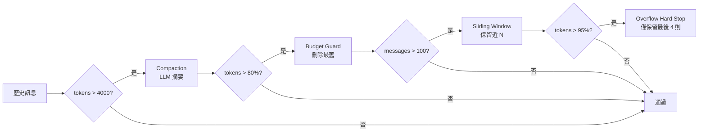

# Context Engine

`src/core/context-engine.ts` — 管理對話歷史的 token 預算，避免超出 LLM context window。

## 策略鏈

四個策略按順序套用，前一個不足以解決時才觸發下一個：

```text
Compaction → Budget Guard → Sliding Window → Overflow Hard Stop
```



## 各策略詳解

### 1. Compaction Strategy

**觸發：** tokens > `triggerTokens`（預設 4000）

- 保留最近 N 個 turn（預設 5）
- 將較舊的訊息送給 LLM 產生摘要
- 摘要取代原始訊息
- 若無 compaction provider，退化為 Sliding Window

### 2. Budget Guard Strategy

**觸發：** tokens > context window 的 `maxUtilization`%（預設 80%）

- 從最舊的非 system 訊息開始刪除
- 持續刪除直到 token 數降到預算內
- 硬刪除，不做摘要

### 3. Sliding Window Strategy

**觸發：** 訊息數 > `maxTurns` × 2（預設 50 × 2 = 100）

- 只保留最近的訊息
- 修復 tool pairing（移除孤兒 `tool_result` 或 `tool_use`）

### 4. Overflow Hard Stop

**觸發：** tokens > context window 的 `hardLimitUtilization`%（預設 95%）

- 緊急措施：只保留最後 4 則訊息
- 設定 `overflowSignaled = true`，通知上層

## Tool Pairing Repair

壓縮或裁切訊息後，可能產生不成對的 tool 呼叫：

- 有 `tool_result` 但缺少對應 `tool_use` → 移除
- 有 `tool_use` 但缺少對應 `tool_result` → 移除
- 空訊息（content 為空陣列）→ 移除

## ContextBreakdown

每次 CE 處理後產生報告：

```typescript
{
  totalMessages: number,
  estimatedTokens: number,
  strategiesApplied: string[],  // 哪些策略被觸發
  tokensBeforeCE?: number,
  tokensAfterCE?: number,
  overflowSignaled?: boolean
}
```

Agent Loop 依此決定是否需要回寫壓縮後的訊息到 session。
