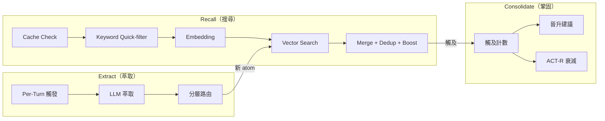

# Memory Engine

`src/memory/` — 三層記憶引擎，實現知識的搜尋、萃取與鞏固。

## 三層架構



## Recall（搜尋）

`recall.ts` — 向量優先、關鍵字增強的 5 步搜尋：

| 步驟 | 說明 |
| ---- | ---- |
| 1. Cache Check | Jaccard ≥ 0.7 且 60s 內 → cache hit |
| 2. Keyword Quick-filter | MEMORY.md trigger 表匹配，命中者加分 |
| 3. Embedding | 透過 Ollama embed API 將 prompt 向量化 |
| 4. Vector Search | 平行搜尋 3 層（global / project / account），各有獨立 topK / minScore |
| 5. Merge + Dedup + Boost | 合併、去重、keyword bonus（+0.05）、排序、回傳 top N |

**降級模式：** Ollama 或 Vector 服務離線時，退化為純關鍵字匹配，標記 `degraded=true`。

## Extract（萃取）

`extract.ts` — 自動從對話中萃取新知識：

**觸發時機：**

| 觸發 | 條件 |
| ---- | ---- |
| E1 Per-Turn | turn 結束後，新內容 ≥ 500 字元 |
| E2 Full-Scan | session 結束或 platform shutdown |

**萃取管線（E3-E8）：**

1. LLM 分析對話內容
2. 萃取 6 種知識類型（fact / decision / preference / ...）
3. 分 3 個層級（company / project / personal）
4. JSON 結構化輸出
5. 路由寫入：
   - company → global atoms
   - project → project atoms
   - personal → account atoms

**執行模式：** Fire-and-forget，不阻塞主流程。

## Consolidate（鞏固）

`consolidate.ts` — 知識的演進與淘汰：

### 晉升機制

| 規則 | 條件 | 動作 |
| ---- | ---- | ---- |
| Auto Promote | 觸及 ≥ 20 次 | [臨] → [觀] 自動晉升 |
| Suggest Promote | 觸及 ≥ 4 次 | [觀] → [固] 建議晉升（需使用者同意） |

### ACT-R 衰減

基於認知科學的 ACT-R 模型計算活化度：

- 每次 recall 命中 → `touchAtom()` 記錄觸及
- 活化度 = f(觸及次數, 時間衰減)
- Sigmoid 正規化到 0-1
- 低於 `archiveThreshold` → 歸檔到 `_staging/archive-candidates.md`

## 記憶儲存結構

```text
~/.catclaw/memory/
  ├── {atom-name}.md              # global atoms
  ├── projects/{projectId}/       # project-scoped atoms
  ├── accounts/{accountId}/       # account-scoped atoms
  ├── episodic/                   # session 統計、rut 偵測
  ├── _vectordb/                  # LanceDB 向量資料庫
  └── _staging/                   # 歸檔候選
```

## Atom 格式

```markdown
- Name: fact-name
- Type: fact
- Tier: personal
- Confidence: [觀]
- Triggers: [keyword1, keyword2]
- Confirmations: 5
- Last-Used: 2025-02-10T10:30:00Z

## 知識

- [觀] 這是一條觀察級知識...
```

三級信心度：
- **[固]** — 確認事實，直接引用
- **[觀]** — 觀察模式，簡短確認後引用
- **[臨]** — 臨時記錄，需明確確認
