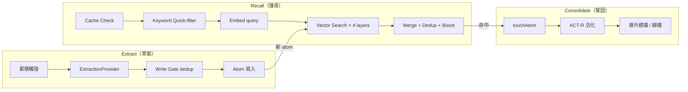

# Memory Engine

`src/memory/` — 四層記憶引擎，實現知識的搜尋、萃取、鞏固與寫入閘門。

## 四層架構

| 層 | namespace | 目錄 | 用途 |
| ---- | ---- | ---- | ---- |
| global | `global` | `{memoryRoot}/` | 平台共用知識 |
| project | `project/{id}` | `{memoryRoot}/projects/{id}/` | 專案知識（暫停用） |
| account | `account/{id}` | `{memoryRoot}/accounts/{id}/` | 使用者偏好/個人資訊 |
| agent | `agent/{id}` | `~/.catclaw/workspace/agents/{id}/memory/` | Agent 專屬記憶 |

Recall 範圍 = `global + account(當前使用者) + agent(若有 agentId)`。寫入：agent context 下寫入 agent 層；其餘依工具 scope 參數決定。



## Recall（搜尋）

`recall.ts` — Vector-First 5 步管線：

| 步驟 | 說明 |
| ---- | ---- |
| 1. Cache Check | 同 channelId 內 Jaccard ≥ 0.7、60s TTL → cache hit |
| 2. Keyword Quick-filter | MEMORY.md trigger 表匹配，命中者後續加分 |
| 3. Embed Query | 透過 Embedding Provider（Ollama / Google）向量化 |
| 4. Vector Search | 四層並行（global / project / account / agent），各層獨立 topK / minScore |
| 5. Merge + Dedup + Boost | 合併、去重、keyword bonus（+0.05）、按 cosine 排序、touchAtom + cache + 回傳 |

**降級模式（degraded=true）：** Embedding 或 Vector 服務離線時，退化為純關鍵字 fallback（固定分數 0.5），結果標記 `matchedBy="keyword"`。

**Blind-Spot：** 所有層皆無命中時 `blindSpot=true`，下游可注入警告防 LLM 編造。

## Extract（萃取）

`extract.ts` + `extraction-provider.ts` — 從對話累積中萃取新知識，**fire-and-forget 不阻塞主流程**。

### ExtractionProvider 抽象層（2026-04-22 起）

記憶系統脫離 Ollama 單一依賴，支援三 provider：

| Provider | 模型範例 | 備註 |
| ---- | ---- | ---- |
| `ollama` | qwen3:14b / qwen3.5:latest | think=true 必要 |
| `anthropic` | claude-haiku-4-5 | auto-resolve API key from auth-profile.json |
| `openai` | gpt-4o-mini | OpenAI-compatible 端點 |

無 Ollama 時 `setup.sh/ps1` 自動切到 Anthropic provider。

### 觸發機制（累積式）

| 條件 | 預設值 | 說明 |
| ---- | ---- | ---- |
| 累積字元 | `accumCharThreshold=200` | 累計新內容字元 |
| 累積 turn | `accumTurnThreshold=5` | 累計 turn 數 |
| 冷卻 | `cooldownMs=120000` | 同 session 萃取冷卻 |
| 單次上限 | `maxItemsPerTurn=3` | 單次 flush 最多萃取幾條 |

達標其一即觸發萃取，輸出 `KnowledgeItem[]` 後寫入閘門。

### 萃取產物

- 6 種知識類型（fact / decision / preference / pitfall / pattern / context）
- 3 個層級路由（company → global / project → project / personal → account）
- 結構化 JSON 輸出，atom markdown 寫入對應目錄

## Consolidate（鞏固）

`consolidate.ts` — 知識的演進與淘汰，與 recall 共用 `computeActivation()`。

### 晉升機制

| 規則 | 條件 | 動作 |
| ---- | ---- | ---- |
| Auto Promote | 觸及 ≥ 20 次 | [臨] → [觀] 自動晉升 |
| Suggest Promote | 觸及 ≥ 4 次 | [觀] → [固] 建議晉升（待使用者同意） |

### ACT-R 衰減

基於認知科學的 ACT-R 模型計算活化度：

- 每次 recall 命中 → `touchAtom()` 記錄觸及
- 活化度 = f(觸及次數, 時間衰減)
- Sigmoid 正規化到 0-1
- 低於 `archiveThreshold` → 歸檔到 `_staging/archive-candidates.md`

## Write Gate（寫入閘門）

`write-gate.ts` — atom 寫入前的 dedup 檢查：

- 餘弦相似度 ≥ `dedupThreshold`（預設 0.80）視為重複，回傳 `reason="duplicate"`
- Prompt-injection pattern 偵測，回傳 `reason="injection"`
- `bypass=true` 跳過閘門（系統內部寫入）

## Episodic Memory

`episodic.ts` — Session 自動摘要，記錄修改/閱讀軌跡與覆轍信號。

| 觸發 | 條件 |
| ---- | ---- |
| 生成 | `modifiedFiles ≥ 1 && session ≥ 2min` 或 `readFiles ≥ 5` |
| TTL | 預設 24 天，每次生成前 `cleanExpired()` |

### 覆轍偵測（RutWarning）

| type | 條件 |
| ---- | ---- |
| `same_file_3x` | 同一檔案修改 ≥ 3 次 |
| `retry_escalation` | retryCount ≥ 2，建議 Fix Escalation |

跨 session 掃描近 10 個 episodic，由 Workflow Guardian 在 session 啟動時注入警告。

## Session Memory

`session-memory.ts` — 對話中自動抄筆記（參考 Claude Code SessionMemory）。

- 觸發：每 `intervalTurns` 輪（預設 10）
- 萃取：最近 15 輪 → ExtractionProvider chat → 摘要筆記
- 儲存：`{memoryDir}/_session_notes/{channelId後8碼}.md`（覆寫保留最新）
- 注入：turn 開始前讀取，前置到 system prompt

## Embedding 模型漂移偵測（2026-04-26 起）

向量資料庫綁定特定 embedding 模型維度。當 `models-config.json` 切換 embedding 模型後：

- Vector service 啟動時偵測 namespace dim mismatch
- Dashboard 顯示警示 banner，提示需重建索引
- `upsert` 時自動 drop+rebuild 該 namespace（避免 dim 不一致 query 失敗）
- 完整重建模式：`drop + seed`，`deleteAtom` 同步清向量 DB

## Recall 失敗的應對

| 情境 | 處理 |
| ---- | ---- |
| Embedding service 離線 | keyword fallback，標記 `degraded=true` |
| Vector search 無命中 | `blindSpot=true`，prompt 注入「無相關記憶」警告防腦補 |
| Atom 過肥（單顆 > budget） | `log.warn` 建議拆分為多個較小單元 |
| 寫入重複 | Write Gate 攔截，回傳 `reason="duplicate"` |

## 設定（MemoryConfig 摘要）

| 欄位 | 預設 | 說明 |
| ---- | ---- | ---- |
| `enabled` | true | 開關 |
| `root` | `{catclawDir}/memory` | 記憶根目錄 |
| `contextBudget` | 3000 | 注入 token 上限 |
| `recall.vectorTopK` | 10 | 向量 top-K |
| `recall.vectorMinScore` | 0.65 | 向量最低相關度 |
| `writeGate.dedupThreshold` | 0.80 | 寫入去重閾值 |
| `extract.enabled` | true | 萃取總開關 |
| `extract.accumCharThreshold` | 200 | 累積字元觸發 |
| `extract.cooldownMs` | 120000 | 同 session 冷卻 |

完整設定參考 [_AIDocs/02-CONFIG-REFERENCE.md](../_AIDocs/02-CONFIG-REFERENCE.md)。

## Atom 格式

```markdown
- Name: fact-name
- Type: fact
- Tier: personal
- Confidence: [觀]
- Triggers: [keyword1, keyword2]
- Confirmations: 5
- Last-Used: 2026-04-27T10:30:00Z

## 知識

- [觀] 這是一條觀察級知識...
```

三級信心度：

- **[固]** — 確認事實，直接引用
- **[觀]** — 觀察模式，簡短確認後引用
- **[臨]** — 臨時記錄，需明確確認

## 模組詳細說明

完整 API、Hook 整合、子模組職責清單請見 [_AIDocs/modules/memory-engine.md](../_AIDocs/modules/memory-engine.md)。
